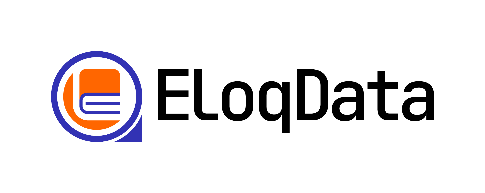

  <a href='https://www.eloqdata.com'>
    </img>
  </a>

  <h1>EloqData: Revolutionary Databases Powering the AI Age</h1>
   
  

**EloqData** is redefining database infrastructure for the AI era with our core innovation: the [Data Substrate](https://www.eloqdata.com/blog/2024/08/11/data-substrate)—a modular, cloud-native architecture that decouples compute, memory, logging, and storage for maximum elasticity and performance.

Our product family includes:

* **[EloqKV]** – A Redis-compatible, transactional key-value engine
* **[EloqSQL]** – A distributed SQL database with MySQL-compatible API
* **[EloqDoc]** – A document database with MongoDB-compatible API

All products offer **full ACID transactions**, **tiered storage**, **autoscaling**, and **cost-optimized** operations out of the box.

For AI-native applications, **[EloqConverged](https://www.eloqdata.com/product/eloqconvergeddb)** enables **cross-model transactions**—allowing you to seamlessly combine key-value, relational, and document operations in a single workload.

[Learn more at eloqdata.com →](https://www.eloqdata.com)

## 💚 Community and Blog

Join us on [Discord](https://discord.gg/nmYjBkfak6) to chat with the EloqData community, share, or ask questions. Come to learn more about EloqData's technology in our <a href="https://eloqdata.com/blog">Blog</a> 

